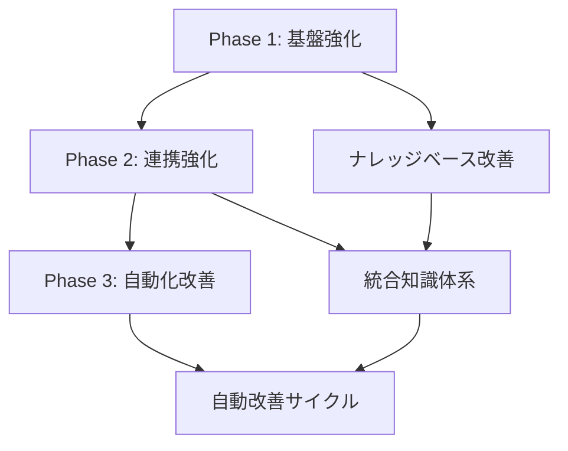

# OKAMI システム改善プロジェクト

## 🎯 プロジェクト概要

OKAMIシステムの継続的改善を目的とした体系的な改善タスク管理プロジェクトです。各改善タスクは段階的な実装を想定し、他のAIアシスタントによる実装を考慮して詳細に文書化されています。

## 📁 プロジェクト構造

```
docs/improve/
├── README.md                        # このファイル（マスター概要）
├── phases/                          # 段階別実装フェーズ
│   ├── phase-1-foundation/          # 🏗️ 基盤強化フェーズ
│   ├── phase-2-integration/         # 🔗 連携強化フェーズ
│   ├── phase-3-automation/          # ⚡ 自動化改善フェーズ
│   ├── phase-4-system-improvements/ # 🔧 システム改善フェーズ
│   ├── phase-5-quality-enhancement/ # 🎯 品質向上フェーズ
│   ├── phase-6-feature-expansion/   # 🚀 機能拡張フェーズ
│   └── phase-7-advanced-features/   # 🔮 高度機能フェーズ
├── templates/                       # 共通テンプレート
│   ├── task-template.md
│   └── implementation-checklist.md
└── archive/                         # アーカイブ
```

## 🚀 実装フェーズ概要

### Phase 1: 基盤強化フェーズ 🏗️
**期間**: 1週間 | **優先度**: 最高 | **前提**: なし

OKAMIシステムの知識基盤を強化し、効果的なナレッジベースの土台を構築します。

#### 含まれるタスク
- **タスク1**: [general.md構造化と内容充実](./phases/phase-1-foundation/task_01_general_md_restructure.md)

**成果物**: 構造化されたgeneral.md、分離された進化履歴

---

### Phase 2: 連携強化フェーズ 🔗
**期間**: 1週間 | **優先度**: 高 | **前提**: Phase 1 完了

現在のOKAMIメモリ機能に知識グラフを統合し、より効果的な知識管理を実現します。

#### 含まれるタスク
- **タスク2**: [知識グラフのCrewAIメモリシステム統合](./phases/phase-2-integration/task_02_knowledge_graph_memory_integration.md)

**成果物**: グラフメモリ統合システム、エンティティ関係管理機能

---

### Phase 3: 自動化改善フェーズ ⚡
**期間**: 2週間 | **優先度**: 中 | **前提**: Phase 1, 2 完了

Evolution Systemの改善提案機能を向上させます。

#### 含まれるタスク
- **タスク3**: [Evolution System改善提案機能向上](./phases/phase-3-automation/task_03_evolution_system_enhancement.md)

**成果物**: 改善されたEvolution System、メトリクス

---

### Phase 4: システム改善フェーズ 🔧
**期間**: 1週間 | **優先度**: 高 | **前提**: なし（独立実装可能）

基本的な問題を修正し、ユーザビリティを向上させます。

#### 含まれるタスク
- **タスク4**: [UI改善](./phases/phase-4-system-improvements/task_04_ui_improvements.md) - Safari日本語入力修正、モバイル対応
- **タスク5**: [API設計改善](./phases/phase-4-system-improvements/task_05_api_improvements.md) - crew_name削除
- **タスク6**: [README最新化](./phases/phase-4-system-improvements/task_06_readme_update.md) - ドキュメント更新

**成果物**: 改善されたUI、簡素化されたAPI、最新のドキュメント

---

### Phase 5: 品質向上フェーズ 🎯
**期間**: 2週間 | **優先度**: 中 | **前提**: Phase 4 推奨

システムの品質と可観測性を向上させます。

#### 含まれるタスク
- **タスク7**: [ガードレール機能実装](./phases/phase-5-quality-enhancement/task_07_guardrail_implementation.md) - ハルシネーション検出
- **タスク8**: ログ出力最適化 - 詳細な動作ログ
- **タスク9**: 知識グラフのメモリ統合 - 高速化と精度向上

**成果物**: 品質保証システム、詳細ログ、統合知識グラフ

---

### Phase 6: 機能拡張フェーズ 🚀
**期間**: 1週間 | **優先度**: 中 | **前提**: Phase 5 推奨

新機能を追加してシステムを拡張します。

#### 含まれるタスク
- **タスク10**: Brave Search統合 - 外部検索機能

**成果物**: 検索ツール統合

---

### Phase 7: 高度機能フェーズ 🔮
**期間**: 4週間+ | **優先度**: 低 | **前提**: Phase 1-6 完了

長期的な高度機能を実装します。

#### 含まれるタスク（優先度低）
- 高度なガードレール統合（NVIDIA NeMo、Amazon Bedrock）
- ユーザー識別・スレッド機能
- Docker Hub MCP統合
- エージェント別LLMモデル選択
- メモリ最適化システム（プルーニング、蒸留、量子化）

**成果物**: エンタープライズレベルの機能

## 🎯 全体目標と期待効果

### 短期目標（Phase 1-2完了時）
- ナレッジベースの検索効率 **20%向上**
- エージェント間での知識共有効率 **30%向上**
- システム全体の理解しやすさの大幅改善

### 長期目標（Phase 3完了時）
- 改善提案の実装成功率 **70%以上**
- 自動化された継続改善サイクルの確立
- システムの自己進化能力の強化

## 📋 実装ガイドライン

### 開始前の確認事項
1. **前提条件の確認**: 各フェーズの前提条件を満たしているか
2. **環境準備**: OKAMIシステムが正常に動作するか
3. **バックアップ**: 必要なファイルのバックアップ作成
4. **テンプレート活用**: [実装チェックリスト](./templates/implementation-checklist.md)の使用

### 実装順序（必須）


### 品質保証
- **段階的実装**: 一度にすべて変更せず、Step-by-Stepで進行
- **動作確認**: 各Step完了時の動作テスト実施
- **ロールバック準備**: 問題発生時の復旧手順の確保

## 🛠️ 利用可能なリソース

### 開発環境・ツール
- **OKAMI System**: main crew, evolution crewでのテスト
- **Docker環境**: 開発・テスト環境
- **バックアップ機能**: 自動的な変更前バックアップ
- **Context7**: 最新AI技術情報の取得

### テンプレート・ガイド
- [タスク作成テンプレート](./templates/task-template.md)
- [実装チェックリスト](./templates/implementation-checklist.md)
- 各フェーズのREADMEファイル

### 参考資料
- [システムアーキテクチャ](../../CLAUDE.md)
- [旧改善提案](./archive/knowledge_system_improvements.md)

## ✅ 成功指標

### 定量的指標
| 指標 | 現在値 | 目標値 | 測定方法 |
|------|--------|--------|----------|
| ナレッジ検索ヒット率 | 基準値 | +20% | main crewテスト |
| 改善提案実装成功率 | 不明 | 70%以上 | Evolution System |
| 横断的質問回答品質 | 基準値 | 向上 | 主観評価 |

### 定性的指標
- 📖 **理解しやすさ**: 新規ユーザーにとっての学習コスト削減
- 🔄 **保守性**: システム変更時の対応コスト削減  
- 🎯 **一貫性**: 全体を通じた設計思想の統一
- 🚀 **拡張性**: 将来的な機能追加への対応力

## ⚠️ 重要な注意事項

### 安全性
- 🔒 **必須バックアップ**: 変更前のファイル保護
- 🧪 **段階的テスト**: 各変更後の動作確認
- 🔄 **ロールバック準備**: 問題発生時の復旧手順

### 互換性
- 🔗 **既存システム**: KnowledgeManagerとの互換性維持
- 📋 **CrewAI仕様**: 標準仕様からの逸脱回避
- 🤝 **他コンポーネント**: 既存機能への影響最小化

### ベストプラクティス
- 📝 **文書化**: 実装時の決定事項記録
- 🧪 **テスト駆動**: 機能実装前のテスト設計
- 👥 **レビュー**: 複数の視点での品質チェック

## 🆘 トラブルシューティング

### よくある問題
| 問題 | 症状 | 対処法 |
|------|------|--------|
| ナレッジが反映されない | 検索結果に表示されない | [システム再起動手順](#システム再起動) |
| Evolution Systemエラー | 改善提案が生成されない | [ログ確認手順](#ログ確認) |
| リンクエラー | Markdownリンクが機能しない | [リンク修正手順](#リンク修正) |

### サポートリソース
```bash
# システム再起動
docker-compose restart okami

# ログ確認  
docker-compose logs okami | grep -i error

# ヘルスチェック
curl http://localhost:8000/health
```

## 📞 実装支援

### 実装時のサポート
- **質問・相談**: 各フェーズのREADMEに詳細な手順を記載
- **テンプレート**: 標準的な実装パターンを提供
- **チェックリスト**: 品質保証のためのチェック項目

### 継続的改善
- **フィードバック収集**: 実装後の効果測定
- **ドキュメント更新**: 知見の反映
- **プロセス改善**: 実装手順の最適化

## 📈 次のステップ

### すぐに開始可能
1. **Phase 1開始**: [基盤強化フェーズ](./phases/phase-1-foundation/)
2. **環境確認**: OKAMIシステムの動作チェック
3. **バックアップ**: 現在のナレッジファイル保護

### 準備が整い次第
- Phase 2の準備（Phase 1完了後）
- Phase 3の準備（Phase 1, 2完了後）
- 新規改善タスクの企画

---

## 📊 プロジェクト情報

**作成日**: 2025-08-02  
**最終更新**: 2025-08-12  
**プロジェクト責任者**: OKAMI Development Team  
**実装担当**: AI Assistant  
**プロジェクトステータス**: Phase 2 Completed, Phase 2.5 Bugfix (一部不要)

## 🎉 実装済みフェーズ

### Phase 1: 基盤強化フェーズ ✅ (2025-08-05完了)
- **タスク1**: general.md構造化と内容充実
  - ✅ 現在のgeneral.mdのバックアップ作成 (`knowledge/general.md.backup`)
  - ✅ 進化履歴の分離 (`knowledge/system/evolution_history.md`)
  - ✅ 新しい体系的なgeneral.md作成（v2.0）
  - ✅ 全エージェント詳細情報の統合
  - ✅ トラブルシューティングガイドの追加
  - ✅ クロスリファレンスの実装
- **追加対応**: `evolution/improvement_parser.py`のバグ修正

### Phase 2: 連携強化フェーズ ✅ (2025-08-12完了)
- **タスク2**: 知識グラフのCrewAIメモリシステム統合
  - ✅ KnowledgeGraphManagerクラスの実装
  - ✅ エンティティ管理機能（追加、更新、削除）
  - ✅ 関係管理機能（追加、削除、検索）
  - ✅ NetworkXベースのグラフ構造
  - ✅ クエリ機能（パス検索、近傍探索、中心性分析）
  - ✅ CrewAIメモリとの統合インターフェース
  - ✅ 永続化機能（JSON形式での保存・読み込み）
  - ✅ 単体テストの実装と動作確認

### Phase 2.5: バグ修正フェーズ 🔧 (2025-08-12状況更新)
- ✅ **タスク2.5.1**: Mem0統合の修正 - **完了（ExternalMemoryへ移行、エラー許容モード実装）**
- ~~**タスク2.5.2**: ベクトルストアの統一~~ - **CrewAIアップデート後に不要**
- ~~**タスク2.5.3**: エンベディング生成の堅牢化~~ - **CrewAIアップデート後に不要**
- ~~**タスク2.5.4**: メモリーシステム統合テスト~~ - **一旦不要**
- **タスク2.5.5**: Evolution Systemファイル更新バグ修正 - 実装予定

**次の実装**: [Phase 3: 自動化改善フェーズ](./phases/phase-3-automation/)を開始できます

---

*このプロジェクトはOKAMIシステムの継続的進化を目指し、段階的かつ体系的な改善を通じてシステム全体の品質向上を実現します。*